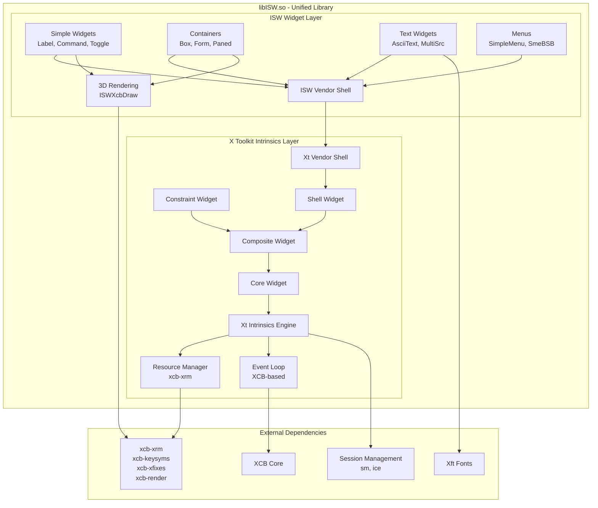

# LibXt Merge Plan: Integration into ISW Project

## Overview

This document outlines the plan to merge the custom XCB-based libXt codebase (located at `/home/adam/libxt`) directly into the ISW (Infi Systems Widgets) project. The goal is to build both libraries as a single unified `libISW.so` library.

## Important Discovery: Vendor.c Analysis

**ISW's [`Vendor.c`](src/Vendor.c) is an extended version of libXt's base Vendor.c**

- libXt's Vendor.c: 147 lines, minimal stub with inherited methods
- ISW's Vendor.c: 661 lines, full implementation with ISW enhancements
- ISW's version includes: I18N support, XPM pixmaps, type converters, XCB adaptations
- Lines 58-62 in ISW Vendor.c state: *"This is a copy of Xt/Vendor.c with additional functionality..."*

**Resolution:** Keep ISW's Vendor.c, exclude libXt's Vendor.c from the merge.

## Current State

### ISW Project Structure
```
/home/adam/Xaw3d/
├── configure.ac (depends on external libXt at /home/adam/libxt)
├── Makefile.am
├── include/
│   ├── ISW/ (ISW widget headers)
│   └── uthash.h
├── src/ (ISW widget source files)
│   ├── AllWidgets.c, AsciiSink.c, AsciiSrc.c, etc.
│   ├── Vendor.c (extended version, replaces libXt's stub)
│   └── ISW-specific files (ISWXcbDraw.c, ISWContext.c, etc.)
└── examples/
```

### LibXt Project Structure
```
/home/adam/libxt/
├── configure.ac
├── Makefile.am
├── include/X11/ (Xt Intrinsics headers)
│   ├── Intrinsic.h, IntrinsicP.h, Core.h, Shell.h, etc.
│   ├── uthash.h, utlist.h
│   └── Generated: StringDefs.h, Shell.h
├── src/ (Xt Intrinsics source files)
│   ├── ActionHook.c, Alloc.c, Callback.c, etc.
│   ├── Vendor.c (SKIP - ISW version is enhanced replacement)
│   └── StringDefs.c (generated)
└── util/
    └── makestrs (utility to generate StringDefs)
```

### Dependencies

**LibXt Dependencies:**
- `sm` (Session Management)
- `ice` (Inter-Client Exchange)
- `x11` (X11 protocol client library)
- `xproto` (X11 protocol headers)
- `kbproto` (X11 keyboard protocol headers)
- `xcb-xrm` (XCB X Resource Manager)
- `xcb-keysyms` (XCB keyboard symbols)
- `xkbcommon` (optional, for keysym name functions)

**ISW Current Dependencies:**
- External libXt (at `/home/adam/libxt`)
- `x11`
- `xext`
- `xcb`
- `xcb-xfixes`
- `xcb-render`
- `xcb-shape`
- `xft`
- Optional: `xpm`

## Merge Strategy

### Approach: Single Library Build

Merge all libXt source files into ISW's `src/` directory and build everything as a single `libISW.so` library. This approach:
- ✅ Simplifies the build system
- ✅ Reduces linking complexity
- ✅ Creates a self-contained library
- ✅ Eliminates external dependency on libXt
- ⚠️ Requires resolving file naming conflicts
- ⚠️ Requires careful header path management

## Implementation Steps

### Step 1: Pre-Merge Analysis ✓

**File Naming Conflicts - RESOLVED:**
- [x] Both ISW and libXt have `Vendor.c`
  - ISW's `Vendor.c`: **Extended implementation** (661 lines) with I18N, XPM, type converters
  - libXt's `Vendor.c`: **Minimal stub** (147 lines) with inherited methods
  - **Resolution:** Keep ISW's `Vendor.c`, exclude libXt's `Vendor.c` from copy
  - ISW's version already contains and extends all libXt base functionality

**Identify Header Conflicts:**
- [x] Both projects use `uthash.h` (should be identical, verify)
- [x] No other header conflicts expected (ISW uses ISW/, libXt uses X11/)

### Step 2: Create Subdirectories

Create the following directory structure:
```
/home/adam/Xaw3d/
├── include/
│   ├── ISW/        (existing ISW widget headers)
│   └── X11/        (NEW: libXt headers)
├── src/
│   ├── (ISW widget sources)
│   ├── (NEW: libXt sources - all .c files from libXt/src/)
│   └── (NEW: generated files - StringDefs.c)
└── util/           (NEW: for makestrs utility)
    └── Makefile.am
```

### Step 3: File Copy Operations

#### 3.1 Copy LibXt Headers
```bash
# Copy all libXt headers to include/X11/
cp -r /home/adam/libxt/include/X11/*.h include/X11/

# Note: StringDefs.h and Shell.h are generated during build
# Copy generation scripts if needed
```

**Files to copy:**
- All `.h` files from `/home/adam/libxt/include/X11/`
- Do NOT copy: `StringDefs.h`, `Shell.h` (these are generated)
- Verify: `uthash.h`, `utlist.h` compatibility

#### 3.2 Copy LibXt Source Files
```bash
# Copy all libXt source files to src/ EXCEPT Vendor.c
cd /home/adam/libxt/src/
for file in *.c; do
  if [ "$file" != "Vendor.c" ]; then
    cp "$file" /home/adam/Xaw3d/src/
  fi
done
# ISW's Vendor.c stays as-is - it already extends libXt's base implementation
```

**Files to copy (from libXt/src/) - 40 files:**
- ActionHook.c, Alloc.c, ArgList.c, Callback.c, ClickTime.c
- Composite.c, Constraint.c, Context.c, Convert.c, Converters.c
- Core.c, Create.c, Destroy.c, Display.c, Error.c, Event.c
- EventUtil.c, Functions.c, GCManager.c, Geometry.c, GetActKey.c
- GetResList.c, GetValues.c, HookObj.c, Hooks.c, Initialize.c
- Intrinsic.c, Keyboard.c, Manage.c, NextEvent.c, Object.c
- PassivGrab.c, Pointer.c, Popup.c, PopupCB.c, Quark.c, RectObj.c
- ResConfig.c, Resources.c, Selection.c, SetSens.c, SetValues.c
- SetWMCW.c, Shell.c, Threads.c, TMaction.c, TMgrab.c, TMkey.c
- TMparse.c, TMprint.c, TMstate.c, VarCreate.c, VarGet.c, Varargs.c
- **EXCLUDED:** Vendor.c (ISW version is superior)

#### 3.3 Copy LibXt Utilities
```bash
# Copy makestrs utility program
mkdir -p util
cp -r /home/adam/libxt/util/* util/
```

**Files to copy:**
- util/makestrs.c
- util/string.list
- util/README (if exists)
- util/Makefile.am (will need modification)

### Step 4: Update Build System

#### 4.1 Update configure.ac

**Add LibXt Dependencies:**
```autoconf
# Old version (line 34-35):
PKG_CHECK_MODULES(X11, [x11 xext xcb xcb-xfixes xcb-render xcb-shape])
PKG_CHECK_MODULES(XFT, [xft])

# New version:
PKG_CHECK_MODULES(XT_DEPS, [sm ice x11 xproto xcb xcb-xrm xcb-keysyms])
PKG_CHECK_MODULES(ISW_DEPS, [xext xcb xcb-xfixes xcb-render xcb-shape])
PKG_CHECK_MODULES(XFT, [xft])

# Add xkbcommon (optional, for keysym functions)
PKG_CHECK_MODULES([XKBCOMMON], [xkbcommon],
    [AC_DEFINE([HAVE_XKBCOMMON], [1], [Have libxkbcommon])],
    [AC_MSG_WARN([libxkbcommon not found; keysym name functions will be stubs])])
```

**Remove External LibXt Paths:**
```autoconf
# DELETE THESE LINES (38-39):
CUSTOM_XT_CPPFLAGS="-I/home/adam/libxt/include"
CUSTOM_XT_LDFLAGS="-L/home/adam/libxt/src/.libs"

# DELETE THIS LINE (45):
ISW_CPPFLAGS="${CUSTOM_XT_CPPFLAGS}"

# DELETE THESE LINES (79-80):
AC_SUBST(CUSTOM_XT_CPPFLAGS)
AC_SUBST(CUSTOM_XT_LDFLAGS)
```

**Add LibXt Build Variables:**
```autoconf
# Add after line 62:
# LibXt build configuration
SRCH_DEFINES="-DXFILESEARCHPATHDEFAULT=\"${datadir}/X11/%L/%T/%N%C%S:${datadir}/X11/%T/%N%C%S\""
ERRORDB_DEFINES="-DERRORDB=\"${datadir}/X11/XtErrorDB\""
AC_SUBST(SRCH_DEFINES)
AC_SUBST(ERRORDB_DEFINES)

# String generation options (for makestrs)
STRINGSABIOPTIONS=""
case $host_os in
    solaris*)
        STRINGSABIOPTIONS="-intelabi -solarisabinames"
        ;;
    sco* | svr4*)
        case $host_cpu in
            i*86) STRINGSABIOPTIONS="-intelabi" ;;
               *) STRINGSABIOPTIONS="" ;;
        esac
        ;;
esac
AC_SUBST(STRINGSABIOPTIONS)
```

**Add Subdirectories:**
```autoconf
# Line 82-85, update AC_CONFIG_FILES:
AC_CONFIG_FILES([Makefile
		include/Makefile
		src/Makefile
		util/Makefile
		isw.pc])
```

#### 4.2 Update Top-Level Makefile.am

```makefile
# Old (line 1):
SUBDIRS = include src

# New (line 1):
SUBDIRS = util include src

ACLOCAL_AMFLAGS = -I m4

pkgconfigdir = $(libdir)/pkgconfig
pkgconfig_DATA = isw.pc

MAINTAINERCLEANFILES = ChangeLog INSTALL

.PHONY: ChangeLog INSTALL

INSTALL:
	$(INSTALL_CMD)

ChangeLog:
	$(CHANGELOG_CMD)

dist-hook: ChangeLog INSTALL
```

#### 4.3 Create util/Makefile.am

```makefile
# util/Makefile.am
# Build makestrs utility program

noinst_PROGRAMS = makestrs

makestrs_SOURCES = makestrs.c
makestrs_CPPFLAGS = $(CPPFLAGS_FOR_BUILD)
makestrs_CFLAGS = $(CFLAGS_FOR_BUILD)
makestrs_LDFLAGS = $(LDFLAGS_FOR_BUILD)

EXTRA_DIST = string.list
```

#### 4.4 Update src/Makefile.am

**Update CFLAGS and CPPFLAGS:**
```makefile
lib_LTLIBRARIES = libISW.la

AM_YFLAGS = -d -p LayYY

AM_CFLAGS = \
	$(CWARNFLAGS) \
	$(XT_DEPS_CFLAGS) \
	$(ISW_DEPS_CFLAGS) \
	$(XFT_CFLAGS) \
	$(XPM_CFLAGS) \
	$(XKBCOMMON_CFLAGS) \
	$(SRCH_DEFINES) \
	$(ERRORDB_DEFINES)

# Header include order: local includes first, then generated
AM_CPPFLAGS = \
	-I$(top_srcdir)/include \
	-I$(top_srcdir)/include/X11 \
	-I$(top_builddir)/include/X11 \
	$(ISW_CPPFLAGS) \
	-DLIBXT_COMPILATION
```

**Add LibXt Source Files:**
```makefile
# LibXt source files (from X Toolkit Intrinsics)
LIBXT_SOURCES = \
	ActionHook.c \
	Alloc.c \
	ArgList.c \
	Callback.c \
	ClickTime.c \
	Composite.c \
	Constraint.c \
	Context.c \
	Convert.c \
	Converters.c \
	Core.c \
	Create.c \
	Destroy.c \
	Display.c \
	Error.c \
	Event.c \
	EventUtil.c \
	Functions.c \
	GCManager.c \
	Geometry.c \
	GetActKey.c \
	GetResList.c \
	GetValues.c \
	HookObj.c \
	Hooks.c \
	Initialize.c \
	Intrinsic.c \
	Keyboard.c \
	Manage.c \
	NextEvent.c \
	Object.c \
	PassivGrab.c \
	Pointer.c \
	Popup.c \
	PopupCB.c \
	Quark.c \
	RectObj.c \
	ResConfig.c \
	Resources.c \
	Selection.c \
	SetSens.c \
	SetValues.c \
	SetWMCW.c \
	Shell.c \
	Threads.c \
	TMaction.c \
	TMgrab.c \
	TMkey.c \
	TMparse.c \
	TMprint.c \
	TMstate.c \
	VarCreate.c \
	VarGet.c \
	Varargs.c \
	XtVendor.c

# Keep ISW_INTERNATIONALIZATION conditional as-is
if ISW_INTERNATIONALIZATION
I18N_SRCS = MultiSrc.c MultiSink.c ISWIm.c ISWI18n.c ISWI18n.h
endif

# ISW widget source files
ISW_SOURCES = \
	AllWidgets.c \
	AsciiSink.c \
	AsciiSrc.c \
	AsciiText.c \
	Box.c \
	Command.c \
	Dialog.c \
	Form.c \
	Grip.c \
	Label.c \
	Layout.c \
	LayYY.h \
	List.c \
	MenuButton.c \
	Paned.c \
	Panner.c \
	Porthole.c \
	Repeater.c \
	Scrollbar.c \
	Simple.c \
	SimpleMenu.c \
	SmeBSB.c \
	Sme.c \
	SmeLine.c \
	SmeThreeD.c \
	StripChart.c \
	TextAction.c \
	Text.c \
	TextPop.c \
	TextSink.c \
	TextSrc.c \
	TextTr.c \
	ThreeD.c \
	Tip.c \
	Toggle.c \
	Tree.c \
	IswVendor.c \
	Viewport.c \
	ISWP.c \
	ISWAtoms.c \
	ISWContext.c \
	ISWDrawing.c \
	ISWInit.c \
	ISWXcbDraw.c \
	ISWXcbDraw.h \
	laygram.y \
	laylex.l \
	$(I18N_SRCS)

# Generated source files
nodist_libISW_la_SOURCES = StringDefs.c

# All sources together
libISW_la_SOURCES = \
	$(LIBXT_SOURCES) \
	$(ISW_SOURCES)
```

**Update LIBADD and LDFLAGS:**
```makefile
libISW_la_LIBADD = \
	$(XT_DEPS_LIBS) \
	$(ISW_DEPS_LIBS) \
	$(XFT_LIBS) \
	$(XPM_LIBS) \
	$(XKBCOMMON_LIBS)

libISW_la_LDFLAGS = -version-info 1:0:0 -no-undefined
```

**Add StringDefs Generation Rules:**
```makefile
BUILT_SOURCES = StringDefs.c laygram.h
CLEANFILES = $(BUILT_SOURCES) StringDefs.h Shell.h

STRING_LIST = $(top_srcdir)/util/string.list

# Generate StringDefs.c and headers
StringDefs.c: $(top_builddir)/util/makestrs$(EXEEXT) $(STRING_LIST)
	$(AM_V_GEN)$(top_builddir)/util/makestrs -i $(top_srcdir) $(STRINGSABIOPTIONS) < $(STRING_LIST) > StringDefs.c
	$(AM_V_at)$(MKDIR_P) $(top_builddir)/include/X11
	$(AM_V_at)cp StringDefs.h $(top_builddir)/include/X11/StringDefs.h
	$(AM_V_at)cp Shell.h $(top_builddir)/include/X11/Shell.h
	$(AM_V_at)rm -f StringDefs.h Shell.h

$(top_builddir)/util/makestrs$(EXEEXT):
	$(AM_V_at)cd $(top_builddir)/util && $(MAKE) $(AM_MAKEFLAGS) makestrs$(EXEEXT)

dist_doc_DATA = README.ISW

EXTRA_DIST = sharedlib.c Template.c
```

#### 4.5 Update include/Makefile.am

```makefile
# ISW widget headers
iswincludedir = $(includedir)/ISW
iswinclude_HEADERS = \
	ISW/AllWidgets.h \
	ISW/AsciiSink.h \
	ISW/AsciiSinkP.h \
	ISW/AsciiSrc.h \
	ISW/AsciiSrcP.h \
	ISW/AsciiText.h \
	ISW/AsciiTextP.h \
	ISW/Box.h \
	ISW/BoxP.h \
	ISW/Cardinals.h \
	ISW/Command.h \
	ISW/CommandP.h \
	ISW/Dialog.h \
	ISW/DialogP.h \
	ISW/Form.h \
	ISW/FormP.h \
	ISW/Grip.h \
	ISW/GripP.h \
	ISW/ISWContext.h \
	ISW/ISWImP.h \
	ISW/ISWInit.h \
	ISW/ISWP.h \
	ISW/ISWXftCompat.h \
	ISW/Label.h \
	ISW/LabelP.h \
	ISW/Layout.h \
	ISW/LayoutP.h \
	ISW/List.h \
	ISW/ListP.h \
	ISW/MenuButton.h \
	ISW/MenuButtoP.h \
	ISW/MultiSink.h \
	ISW/MultiSinkP.h \
	ISW/MultiSrc.h \
	ISW/MultiSrcP.h \
	ISW/Paned.h \
	ISW/PanedP.h \
	ISW/Panner.h \
	ISW/PannerP.h \
	ISW/Porthole.h \
	ISW/PortholeP.h \
	ISW/Repeater.h \
	ISW/RepeaterP.h \
	ISW/Reports.h \
	ISW/Scrollbar.h \
	ISW/ScrollbarP.h \
	ISW/Simple.h \
	ISW/SimpleMenP.h \
	ISW/SimpleMenu.h \
	ISW/SimpleP.h \
	ISW/Sme.h \
	ISW/SmeBSB.h \
	ISW/SmeBSBP.h \
	ISW/SmeLine.h \
	ISW/SmeLineP.h \
	ISW/SmeP.h \
	ISW/SmeThreeD.h \
	ISW/SmeThreeDP.h \
	ISW/StripCharP.h \
	ISW/StripChart.h \
	ISW/Template.h \
	ISW/TemplateP.h \
	ISW/Text.h \
	ISW/TextP.h \
	ISW/TextSink.h \
	ISW/TextSinkP.h \
	ISW/TextSrc.h \
	ISW/TextSrcP.h \
	ISW/ThreeD.h \
	ISW/ThreeDP.h \
	ISW/Tip.h \
	ISW/TipP.h \
	ISW/Toggle.h \
	ISW/ToggleP.h \
	ISW/Tree.h \
	ISW/TreeP.h \
	ISW/VendorEP.h \
	ISW/Viewport.h \
	ISW/ViewportP.h

# X Toolkit Intrinsics headers (libXt)
xtincludedir = $(includedir)/X11
xtinclude_HEADERS = \
	X11/CallbackI.h \
	X11/Composite.h \
	X11/CompositeP.h \
	X11/ConstrainP.h \
	X11/Constraint.h \
	X11/ContextI.h \
	X11/ConvertI.h \
	X11/Core.h \
	X11/CoreP.h \
	X11/CreateI.h \
	X11/EventI.h \
	X11/HookObjI.h \
	X11/InitialI.h \
	X11/Intrinsic.h \
	X11/IntrinsicI.h \
	X11/IntrinsicP.h \
	X11/Object.h \
	X11/ObjectP.h \
	X11/PassivGraI.h \
	X11/RectObj.h \
	X11/RectObjP.h \
	X11/ResConfigP.h \
	X11/ResourceI.h \
	X11/SelectionI.h \
	X11/ShellI.h \
	X11/ShellP.h \
	X11/ThreadsI.h \
	X11/TranslateI.h \
	X11/VarargsI.h \
	X11/Vendor.h \
	X11/VendorP.h \
	X11/XtDatabase.h \
	X11/XtFuncproto.h \
	X11/XtOptions.h \
	X11/Xtos.h \
	X11/XtQuark.h \
	X11/XtTypes.h \
	X11/XtValue.h \
	X11/uthash.h \
	X11/utlist.h

# Generated headers (created during build)
nodist_xtinclude_HEADERS = \
	X11/StringDefs.h \
	X11/Shell.h

DISTCLEANFILES = \
	X11/StringDefs.h \
	X11/Shell.h

# Top-level utility headers
nobase_include_HEADERS = uthash.h
```

#### 4.6 Update isw.pc.in

```
prefix=@prefix@
exec_prefix=@exec_prefix@
libdir=@libdir@
includedir=@includedir@

Name: ISW
Description: Infi Systems Widgets - XCB-based 3D Widget Library (includes embedded X Toolkit Intrinsics)
Version: @PACKAGE_VERSION@
Requires: sm ice x11 xcb xcb-xrm xcb-keysyms xext xcb-xfixes xcb-render xcb-shape xft
Requires.private: xkbcommon
Cflags: -I${includedir}
Libs: -L${libdir} -lISW
```

### Step 5: Handle File Renaming

#### 5.1 Rename ISW's Vendor.c

```bash
cd src/
mv Vendor.c IswVendor.c
```

**Update references in other files:**
- Update any `#include` or references to `Vendor.c` compilation unit

#### 5.2 Rename libXt's Vendor.c (after copying)

```bash
cd src/
mv Vendor.c XtVendor.c  # This is the libXt version
```

**Update src/Makefile.am:**
- Use `XtVendor.c` in `LIBXT_SOURCES` list

### Step 6: Source Code Adjustments

#### 6.1 Update Include Paths in Copied Files

After copying libXt sources, verify that all `#include` statements work:

**LibXt files should include:**
```c
#include <X11/Intrinsic.h>     // From include/X11/
#include <X11/IntrinsicP.h>
#include <X11/Core.h>
// etc.
```

**ISW files should include:**
```c
#include <ISW/ISW.h>           // From include/ISW/
#include <X11/Intrinsic.h>     // From include/X11/ (now internal)
// etc.
```

#### 6.2 Update IswVendor.c (renamed from Vendor.c)

Search for any references to the Vendor compilation unit and update as needed.

### Step 7: Testing

#### 7.1 Clean Build Test
```bash
make distclean
./autogen.sh
./configure --enable-arrow-scrollbars --enable-internationalization
make -j$(nproc)
```

**Expected outcomes:**
1. ✅ util/makestrs builds successfully
2. ✅ StringDefs.c is generated
3. ✅ All libXt sources compile
4. ✅ All ISW sources compile
5. ✅ Single `libISW.so` is created
6. ✅ No undefined symbols

#### 7.2 Dependency Verification
```bash
# Verify no external libXt dependency
ldd src/.libs/libISW.so | grep libXt
# Should return NOTHING

# Verify XCB dependencies (should show xcb libraries)
ldd src/.libs/libISW.so | grep xcb
# Should show: libxcb.so, libxcb-xrm.so, libxcb-keysyms.so, etc.

# Verify no Xlib dependencies
ldd src/.libs/libISW.so | grep libX11.so
# Should show libX11.so (minimal X11 protocol, NOT Xlib rendering)
```

#### 7.3 Build Examples
```bash
make -C examples
./examples/isw_demo
```

### Step 8: Documentation Updates

#### 8.1 Update BUILD_INSTRUCTIONS.md

Remove all references to external libXt:
- Delete sections about custom libXt at `/home/adam/libxt`
- Delete instructions about `CPPFLAGS` and `LDFLAGS` for external libXt
- Update with new integrated build instructions

```markdown
# ISW Build Instructions

## Overview

ISW is a self-contained XCB-based widget library that includes an embedded
X Toolkit Intrinsics (libXt) implementation. Everything is built as a single
`libISW.so` library.

## Build Requirements

- Autotools (autoconf, automake, libtool)
- XCB libraries: xcb, xcb-xrm, xcb-keysyms, xcb-xfixes, xcb-render, xcb-shape
- SM and ICE libraries (Session Management)
- X11 protocol libraries
- Xft (font rendering)
- Optional: xkbcommon (for keysym name functions)

## Build Instructions

```bash
./autogen.sh
./configure --enable-arrow-scrollbars --enable-internationalization
make
sudo make install
```

## What Gets Built

- `libISW.so` - Single unified library containing:
  - X Toolkit Intrinsics (Xt) - XCB-based implementation
  - ISW Widgets - 3D Athena-compatible widgets
- Header files:
  - `/usr/local/include/X11/*` - Xt Intrinsics headers
  - `/usr/local/include/ISW/*` - ISW widget headers
```

#### 8.2 Update README

```markdown
# ISW (Infi Systems Widgets) - XCB-based 3D Widget Library

ISW is a modern, self-contained widget library for X11 applications featuring:
- **Embedded X Toolkit Intrinsics** - XCB-based Xt implementation (no external libXt needed)
- Native XCB rendering (no Xlib dependencies)
- 3D visual effects with shadows and lighting
- Arrow scrollbars for improved usability
- Full internationalization support
- Xft font rendering with anti-aliasing

This library provides everything needed to build X11 graphical interfaces in a
single, unified `libISW.so` library.

## Architecture

```
libISW.so
├── X Toolkit Intrinsics (Xt) - XCB port
│   ├── Widget hierarchy (Core, Composite, Constraint, Shell, etc.)
│   ├── Event handling and translation tables
│   ├── Resource management (using xcb-xrm)
│   └── Geometry management
└── ISW Widgets (Xaw3d-compatible)
    ├── Basic widgets (Label, Command, Toggle, etc.)
    ├── Container widgets (Box, Form, Paned, Viewport, etc.)
    ├── Text widgets (AsciiText, MultiSrc, MultiSink)
    └── Menu widgets (SimpleMenu, MenuButton, SmeBSB, etc.)
```

## Dependencies

**Required:**
- xcb, xcb-xrm, xcb-keysyms, xcb-xfixes, xcb-render, xcb-shape
- sm, ice (Session Management)
- x11 (X11 protocol client library)
- xft (font rendering)

**Optional:**
- xkbcommon (for keysym name resolution)
- xpm (for XPM image support)

## Building

See [`BUILD_INSTRUCTIONS.md`](BUILD_INSTRUCTIONS.md) for detailed instructions.

## License

See [`COPYING`](COPYING) file for license information.
```

## File Naming Conflicts - Resolution

| Original File | Project | Renamed To | Reason |
|---------------|---------|------------|--------|
| `src/Vendor.c` | ISW | `src/IswVendor.c` | Conflicts with libXt's Vendor.c; ISW-specific widget |
| `src/Vendor.c` | libXt | `src/XtVendor.c` | Distinguish from ISW's Vendor widget |

## Summary of Changes

### Files Added
- `include/X11/*.h` (40+ libXt header files)
- `src/*.c` (40+ libXt source files, renamed XtVendor.c)
- `util/makestrs.c`, `util/string.list`
- `util/Makefile.am`

### Files Modified
- `configure.ac` (add libXt dependencies, remove external paths)
- `Makefile.am` (add util subdirectory)
- `src/Makefile.am` (add libXt sources, update build rules)
- `include/Makefile.am` (add X11 headers)
- `isw.pc.in` (update dependencies)
- `BUILD_INSTRUCTIONS.md` (remove external libXt references)
- `README` (document integrated architecture)

### Files Renamed
- `src/Vendor.c` → `src/IswVendor.c` (ISW widget)
- Copied `libXt/src/Vendor.c` → `src/XtVendor.c` (Xt base class)

## Mermaid Architecture Diagram



## Risk Assessment

| Risk | Likelihood | Impact | Mitigation |
|------|------------|--------|------------|
| Build system complexity | Medium | Medium | Thorough testing, incremental changes |
| File naming conflicts | Low | High | Pre-identified, renaming plan in place |
| Header path issues | Medium | Medium | Careful include path ordering in Makefiles |
| Symbol conflicts | Low | High | Different namespaces (Xt vs ISW), minimal overlap |
| Missing dependencies | Low | Medium | Comprehensive pkg-config checks in configure.ac |
| Generated file issues | Medium | Medium | Copy util/makestrs from working libXt build |

## Success Criteria

1. ✅ Single `libISW.so` library builds successfully
2. ✅ No external libXt dependency
3. ✅ All symbols resolve (no undefined references)
4. ✅ Examples compile and run
5. ✅ `ldd` shows no `libXt.so` dependency
6. ✅ `ldd` shows XCB dependencies (not Xlib)
7. ✅ Headers install to `/usr/local/include/X11/` and `/usr/local/include/ISW/`
8. ✅ pkg-config works: `pkg-config --libs --cflags isw`

## Next Steps

1. Review this plan with stakeholders
2. Create backup of current working state
3. Begin implementation following steps 1-8
4. Test thoroughly at each step
5. Update documentation
6. Commit changes with detailed commit messages

---

**Plan Status:** READY FOR REVIEW
**Created:** 2026-03-20
**Last Updated:** 2026-03-20
